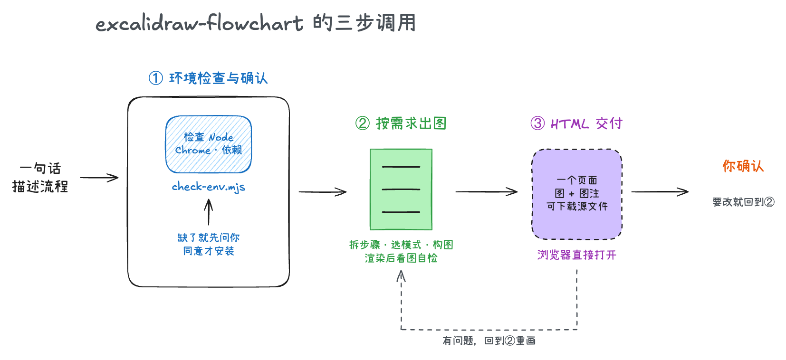
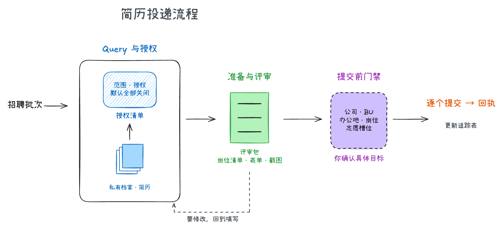
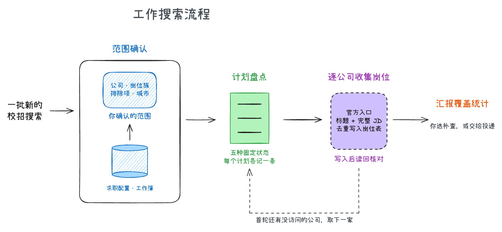
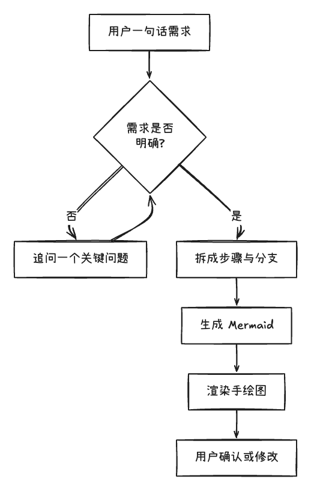
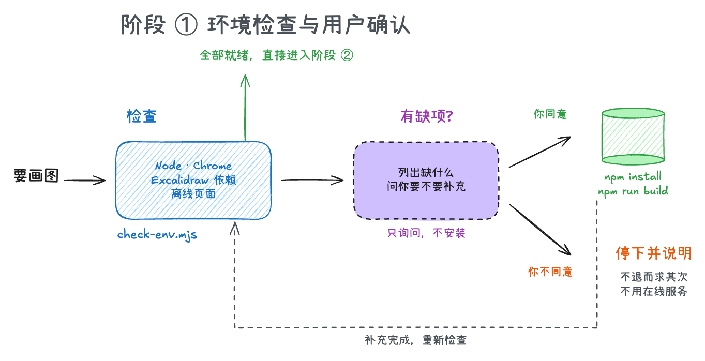
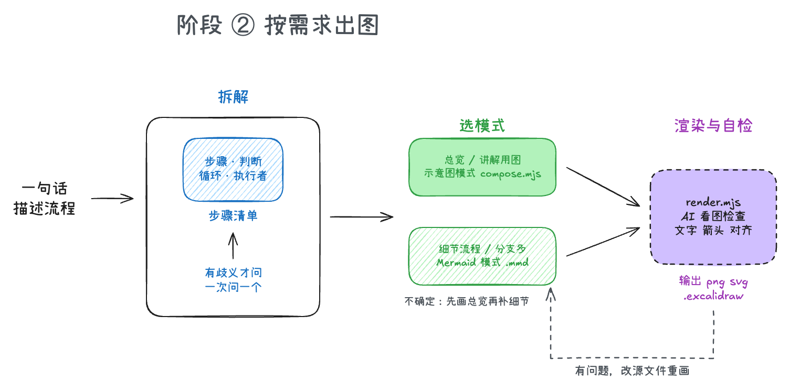
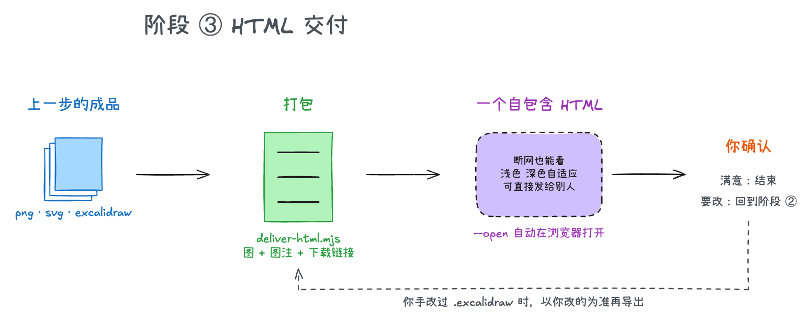

# excalidraw-flowchart



> 全流程一张图:先检查环境并问你,再按需求出图,最后用一个 HTML 页面交付。这张图本身就是用本 Skill 的示意图模式画的。

## 这是什么?

给别人讲一件事,最快的方式是画张图,但在专业绘图软件里拖框、连线、对齐,经常比写那段话还费时间。而 AI 一般只会回你一大段文字,或者一堆挤在一起的字符画。

这个 Skill 让 AI 替你做这一步:你用自然语言说一遍流程,它把话拆成"步骤、判断、循环",画成 Excalidraw 的手绘白板风流程图。展示 Agent 架构、大模型工作流时,这种风格很常见,看着不像正式文档那么拘束,也更容易让人愿意看。

它能帮你:

- **拆流程**:从一段描述里找出起点、终点、先后步骤、判断分支和回到前面的循环,拆得有歧义时一次只问你一个问题。
- **画手绘图**:生成带手写质感的白板风图,中文、英文都能直接写在图里。总览用彩色阶段标题加图标的**示意图风格**,细节流程用 **Mermaid 自动排版**。
- **本地完成**:Excalidraw 下载在你的电脑上,装好之后断网也能画,你的流程内容不会上传到任何地方。
- **留出手改空间**:除了图片,还给你可以拖进 Excalidraw 继续手改的源文件。
- **自己先检查**:画完 AI 会看一遍成图,文字被截断、箭头指错之类的问题先改掉再给你。

## 最终成品是什么?

每次画图得到同名的三个文件:

| 文件 | 里面是什么 | 什么时候用 |
|---|---|---|
| `名字.png` | 图片(默认 2 倍清晰度,可用 `--scale` 调整) | 贴进文档、PPT、聊天、README |
| `名字.svg` | 矢量图,任意缩放不失真 | 放进网页,或需要印刷级清晰度时 |
| `名字.excalidraw` | 可编辑的源文件 | 想自己调位置、改颜色、补几笔时,拖进 [excalidraw.com](https://excalidraw.com) 或本地 Excalidraw |

下面是两种风格的实际效果。

**示意图风格**(总览用,`examples/style-demo/`):





**Mermaid 风格**(细节流程用,`examples/demo.mmd`):



## SKILL 的执行流程

每次调用固定走三个阶段,每个阶段一张图加一段说明。

### 阶段 ① 环境检查与用户确认



动手画图之前,先运行 `check-env.mjs` 检查四样东西:Node.js、Chrome、Excalidraw 依赖和离线渲染页面。全部齐全就直接进入阶段 ②。

缺了东西时,AI 只做一件事:告诉你缺什么、要装什么、大概多大、要不要联网,然后问你是否补充。你同意,它才运行 `npm install` 和 `npm run build`,装完回到检查;你不同意,它就停下来说明"没有这个工具就没法在本机出图",不会悄悄改用在线服务,也不会把你的流程内容发到外部网站。Node.js 和 Chrome 属于系统软件,AI 会告诉你去哪里装,不代装。

### 阶段 ② 按需求出图



AI 先把你的描述拆成步骤、判断、循环和执行者,列一张简短的步骤清单给你核对。描述有歧义、会改变图的结构时才发问,而且一次只问一个问题。

接着按图的用途选模式。要放在 README 开头、给人讲解用的总览图,走**示意图模式**:用彩色阶段标题、图标和分组框手动摆放,元素控制在 8 个以内。要展开每一步细节、分支很多的流程,走 **Mermaid 模式**:写一份流程文本,自动排版。拿不准时先画总览,再给每个阶段补细节图。

渲染完成后,AI 会自己打开成图检查:文字有没有被切掉或压在边框上,说明和图形有没有对齐,箭头有没有指错。有问题就改源文件重画,检查通过才往下走。

### 阶段 ③ HTML 交付



`deliver-html.mjs` 把这次的所有图打包成**一个自包含的 HTML 页面**:每张图带图注,页面里直接附上 PNG、SVG 和可编辑源文件的下载链接。图片和字体都嵌在页面里,断网也能打开,可以直接发给别人,并自动适配浅色和深色模式。加上 `--open` 参数会直接在浏览器里打开。

你看完满意就结束。想改,告诉 AI 改哪里,它回到阶段 ② 重画再导出。如果你在 Excalidraw 里手改过 `.excalidraw`,AI 会以你改过的文件为准重新导出,不会用旧的源文件覆盖。

## 我应该准备什么材料?

1. **装好 Node.js 和 Google Chrome。**
2. **第一次使用时让 AI 检查环境。** 缺 Excalidraw 时它会先问你,同意后运行 `npm install && npm run build`(下载并打包 Excalidraw,之后不再联网)。
3. **对 AI 说一句话**,比如"把用户登录流程画成手绘流程图:输入账号,校验密码,失败三次就锁定"。

## 我可以在哪些工具上使用?

任何能读取 Skill 并在你电脑上执行命令的 AI 工具,例如 Claude Code、Codex。

**推荐:让 AI 帮你安装。** 把这个文件夹交给 AI,说"帮我检查并装好这个 Skill 的环境",它会按阶段 ① 先问你再安装。

**手动安装:**

| 工具 | 复制到 | 装好后的完整路径 |
|---|---|---|
| Claude Code | 用户目录 `~/.claude/skills/` | `~/.claude/skills/excalidraw-flowchart/SKILL.md` |
| Codex | 用户目录 `~/.codex/skills/`(或项目里的 `.agents/skills/`) | `~/.codex/skills/excalidraw-flowchart/SKILL.md` |

复制时把文件夹名开头的【手绘流程图】去掉,保留 `excalidraw-flowchart`。复制后第一次使用时,AI 会按阶段 ① 检查并询问是否补充依赖;也可以自己进入该目录运行 `npm install && npm run build`。

## 使用技巧

**怎么指挥 AI**

- 直接描述流程,不用懂 Mermaid 或坐标。想要总览图就说"画一张总览",想要步骤细节就说"把每一步展开"。把判断条件和"不通过怎么办"一并说出来,图会更完整。
- 流程很长时先说"按阶段拆成几张图",一张图控制在 12 个节点左右最清楚。
- 默认交付一个 HTML 页面;只想要图片文件时直接说"只要 PNG"。
- 想要横向的图就说"横着画",想竖着放进手机长图就说"竖着画"。
- 改图时直接说"把第三步拆成两步""给失败分支加一个重试",AI 会改源文件并重新渲染。

**每类产物怎么用**

- 要发出去的:用 `.png`。
- 要放进网页或放大打印的:用 `.svg`。
- 想亲手微调的:把 `.excalidraw` 拖进 Excalidraw。手改过之后告诉 AI 以你改过的为准,它不会再用旧稿覆盖。

## FAQ

**需要联网吗?** 只有第一次 `npm install` 下载 Excalidraw 时需要,之后画图完全离线。

**Excalidraw 免费吗?** 免费,MIT 开源协议。

**为什么要装 Chrome?** 渲染用 Chrome 的无头模式把图导出成图片,Skill 自己不带浏览器。Chrome 不在默认位置时,设置环境变量 `CHROME_PATH`。

**图画得不对怎么办?** 告诉 AI 哪里不对,它会改源文件重画。如果是流程本身没说清,它会问你而不是自己编。

**不适合做什么?** 它只画流程图和类似的结构图,不替你判断流程本身对不对;复杂的泳道图样式有限,需要时 AI 会改用精确坐标的方式画。

## 附录:文件结构

```text
excalidraw-flowchart/
├── SKILL.md                 Skill 入口:工作流与作图原则
├── README.md                本文件
├── package.json             Excalidraw 等依赖清单
├── scripts/
│   ├── build.mjs            把 Excalidraw 打包成离线页面(写入 dist/)
│   ├── check-env.mjs        阶段 ①:检查环境,只报告、不安装
│   ├── compose.mjs          示意图风格的构图工具(标题、图标、分组框、箭头)
│   ├── entry.js             浏览器内的转换与导出代码
│   ├── render.mjs           阶段 ②:输入图描述,输出 png / svg / excalidraw
│   └── deliver-html.mjs     阶段 ③:打包成一个自包含的 HTML 页面
├── references/
│   ├── style-guide.md       示意图风格指南与自检清单
│   └── mermaid-tips.md      Mermaid 写法与常见坑
├── examples/
│   ├── demo.mmd             Mermaid 示例
│   ├── style-demo/          示意图风格示例(简历投递、工作搜索)
│   └── job-flows/           两个求职项目的 Mermaid 细节流程图(10 张)
└── docs/                    README 里的全流程图与三个阶段图(含构图脚本)
```

`node_modules/` 与 `dist/` 由安装命令生成,不进版本库。
