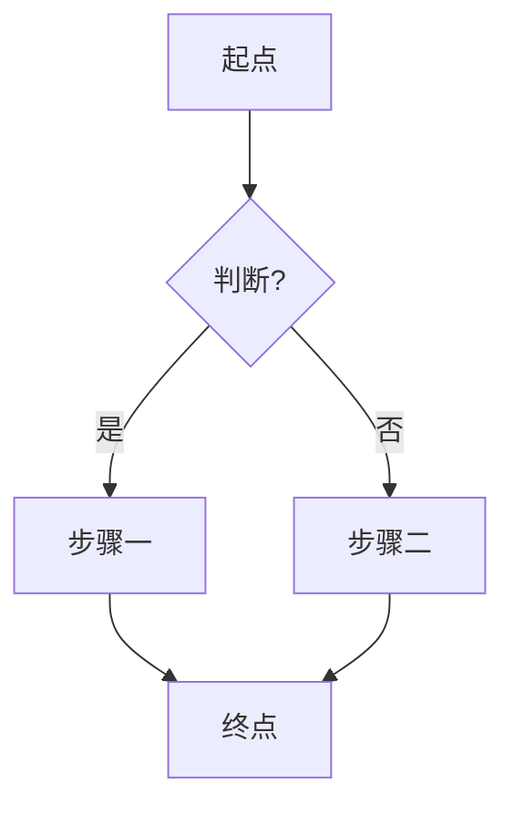

# Mermaid 写法与避坑

## 基本骨架



- `[文字]` 矩形(步骤)、`{文字}` 菱形(判断)、`([文字])` 圆角(起止)、`[(文字)]` 数据库。
- `A -- 标签 --> B` 给连线加文字;循环就是让后面的节点再指回前面的节点。
- `TD` 自上而下,`LR` 自左向右。步骤多选 `TD`,阶段少而宽选 `LR`。

## 常见坑

1. **文字里有括号、冒号、引号**:整句用双引号包起来,如 `A["读取配置(config.json)"]`。
2. **节点 ID 用字母**:`A`、`B1`、`step_a`,不要用中文或空格做 ID,中文放在方括号里当显示文字。
3. **标签太长会撑破节点**:超过一行的内容拆成两个节点,或在方括号里用 `<br/>` 换行。
4. **子图泳道**:`subgraph` 能转,但边框和标题样式有限;要精确泳道改用 JSON 骨架。
5. **一次渲染失败**:先把图缩到最小能跑的版本,再逐段加回去,定位出错的那一行。
6. **图太挤**:减少节点,或改 `LR`/`TD` 换方向,不要靠缩小字号。

## JSON 骨架示例

```json
[
  { "type": "rectangle", "id": "a", "x": 0,   "y": 0, "width": 180, "height": 70, "label": { "text": "收集需求" } },
  { "type": "rectangle", "id": "b", "x": 280, "y": 0, "width": 180, "height": 70, "label": { "text": "画出流程图" } },
  { "type": "arrow", "x": 180, "y": 35, "start": { "id": "a" }, "end": { "id": "b" } }
]
```

`start`/`end` 绑定节点 ID 后,箭头会自动贴边连接。
